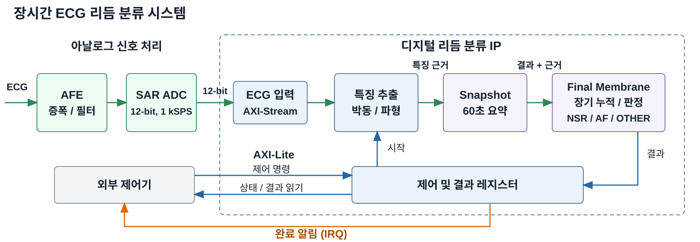
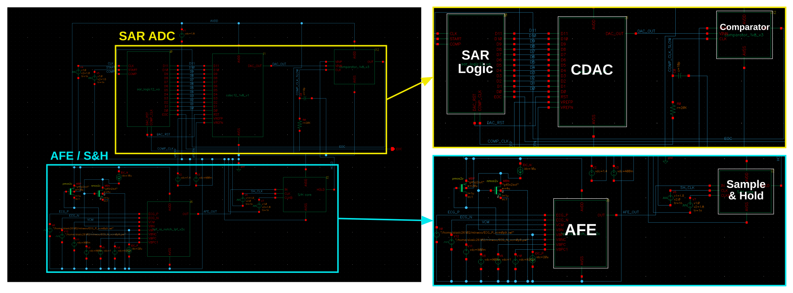
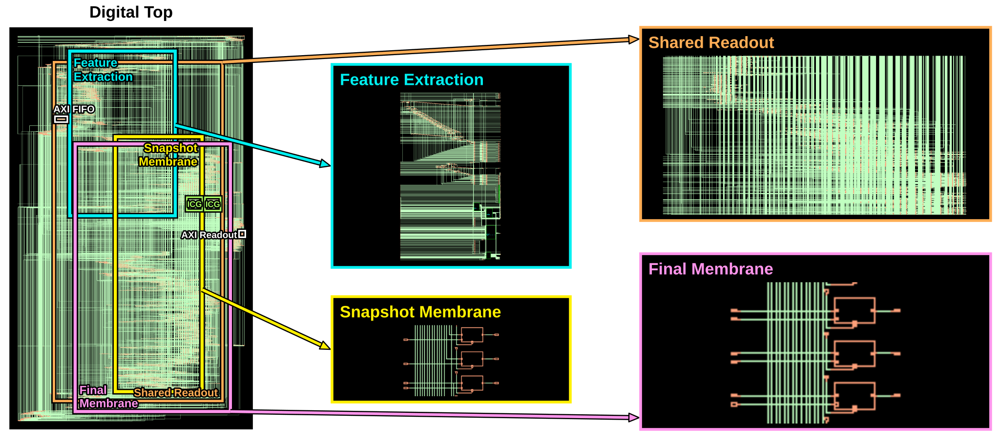
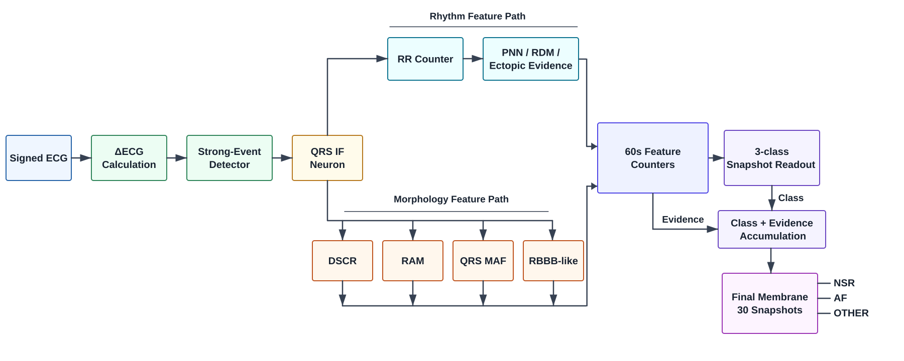
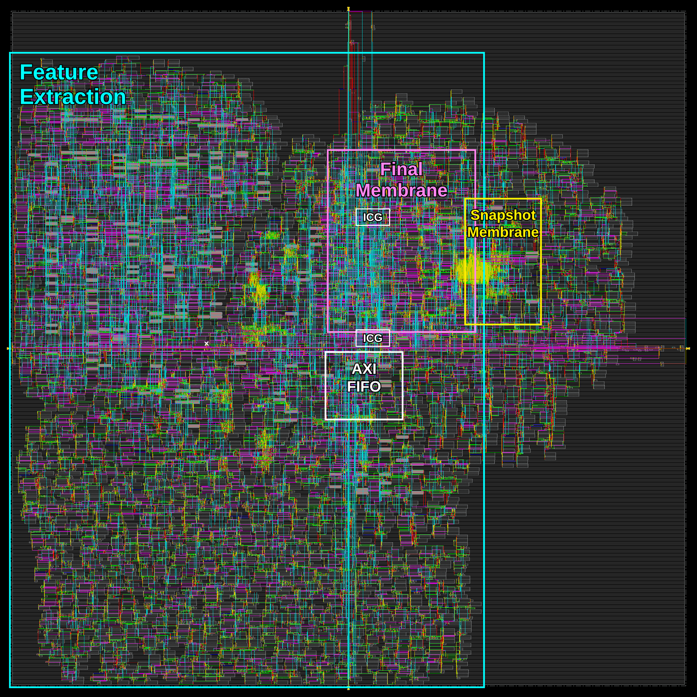

# 아날로그 전처리와 디지털 뉴로모픽 구조를 결합한 장시간 ECG 리듬 분류용 저전력 ASIC 설계

> 2026 한국 대학생 반도체 설계 경진대회 · 한양대학교 융합전자공학부 · 양건, 서민우, 이수환

[설계보고서 전문](reports/INTEGRATED_TECHNICAL_REPORT_KR.md) · [PDF](reports/ECG_Design_Report_2026.pdf) · [문서 목차](docs/README_KR.md) · [코드와 재현 안내](REPRODUCIBILITY_KR.md)

이 문서의 설계 설명은 제출 보고서의 표현을 그대로 사용했습니다. 현재 설계의 분류는 **NSR / AF / OTHER**입니다. 저장소 주소의 `4-Class`와 과거 자료는 이전 설계의 이력입니다.

## 설계 요약

<!-- report:p2:id1 -->
ECG는 심장의 전기적 활동을 기록한 전압 파형으로, 간헐적 이상을 파악하려면 박동의 모양과 간격, 특징의 지속 양상을 살펴야 한다. 본 작품은 Holter 방식의 장시간 관찰을 위해 전체 파형을 저장하지 않고 박동 간격과 파형 특징에서 얻은 근거를 누적하는 저전력 ASIC을 설계하였다. 아날로그부는 1.8 V AFE로 ECG를 증폭하고 불필요한 성분을 줄인 뒤, 12-bit SAR ADC로 초당 1,000개의 코드를 생성한다. 디지털부는 박동 간격과 파형 특징을 60초 단위로 집계해 구간별 리듬을 분류하고, 각 구간의 판정 결과와 관찰된 특징에 따른 점수를 리듬별로 누적한다. 이후 누적 점수를 비교하여 전체 기록을 정상 동리듬(NSR), 심방세동(AF), 기타 비정상 리듬(OTHER) 중 하나로 최종 판정한다. 이 과정에 이벤트 기반 클록 게이팅을 적용해 연산할 때만 클록을 공급하고, 완료 후 차단하였다. 설계 결과 시험용 ECG 96건의 정확도는 94.79%였으며, 평균 소비전력은 아날로그부 0.256 mW, 디지털부 1.366 mW로 추정됐다. 이를 바탕으로 24시간 이상 관찰하는 웨어러블용 리듬 분류 IP를 지향한다.

<!-- report:p3:id17 -->

<!-- report:p3:id18 -->
**그림 1. AFE–ADC와 AXI 인터페이스를 갖춘 디지털 분류 IP의 전체 구성**

## 창의성

<!-- report:p2:id3 -->
간헐적인 심장 리듬 변화를 포착하려면 Holter 검사처럼 ECG를 오래 관찰해야 한다. 이를 몸에 붙이는 작은 기기에서 수행하려면 정확도와 함께 저장 공간과 전력을 고려해야 한다. 본 작품은 전체 파형 대신 판단에 필요한 정보를 남기고, 그 정보를 처리할 때 분류 회로를 동작시키도록 설계하였다.

<!-- report:p2:id4 -->
이를 위해 파형의 특징을 스파이크로 표현하고 분류 근거를 막전위에 누적하는 디지털 뉴로모픽 구조를 적용하였다. 박동 검출 뉴런은 입력 변화에서 얻은 사건을 누적해 기준에 도달하면 발화하고, 특징 검출 뉴런은 박동 간격의 규칙성과 파형 변화를 알린다. 60초 동안 모은 특징 누적값으로 구간을 분류하고, 판정 결과와 특징 근거를 Snapshot으로 요약한다. 여러 Snapshot의 근거를 리듬별 최종 막전위(Final Membrane)에 가중 누적한 뒤 세 막전위를 비교해 NSR, AF, OTHER 중 하나로 판정한다.

<!-- report:p2:id5 -->
처리 구조에 맞춰 입력 회로는 표본과 특징 전달을 마치면 클록을 차단하고, 분류 및 최종 누적 회로는 특징 누적값을 처리할 때만 동작시켰다. 특징별 계산에는 같은 연산 경로를 재사용하고 점수 범위에 맞춰 저장 폭을 정하였다. 뉴로모픽 특징 추출과 장기 판단에 필요한 연산 자원, 저장 공간과 클록 공급을 함께 설계한 점이 본 작품의 창의성이다.

## 아날로그 구성 및 동작

<!-- report:p5:id29 -->
피부의 서로 다른 위치에 부착한 두 전극의 신호는 고역통과필터(HPF)를 거쳐 저주파 성분이 줄어든다. 3-op-amp 계측증폭기(IA)는 두 입력의 미세한 ECG 전압 차이를 증폭하고 공통 잡음을 억제한다. 이어 수동 Twin-T 노치 필터와 RC 저역통과필터(LPF)로 60 Hz 전원 간섭과 고주파 성분을 줄여 샘플앤홀드(S/H)에 전달한다. S/H는 ADC 변환 동안 커패시터에 입력 전압을 유지한다. SAR ADC는 이를 커패시터 DAC(CDAC)의 시험 전압과 비교해 상위 비트부터 결정하고 12-bit 코드를 출력한다.

<!-- report:p4:id27 -->

<!-- report:p4:id28 -->
**그림 3. AFE–S/H–SAR ADC의 실제 회로와 주요 블록**

<!-- report:p5:id30 -->
아날로그 회로는 Cadence Virtuoso에서 트랜지스터 수준으로 구성하고, 변환 순서를 제어하는 Verilog-A SAR 모델을 연결해 Spectre로 검증하였다. 세부 설계 항목은 표 2와 같다.

<!-- report:p5:id31 -->
**표 2. 아날로그부의 설계 항목**

<!-- report:p5:id32 -->
| 설계 항목 | 회로의 고정 설정 |
| --- | --- |
| 전원 / 공통모드 / 기준전압 | 1.8 V / 0.9 V / 0.4~1.4 V |
| AFE 이득 / 필터 설계 주파수 | 199.36 V/V / HPF 0.48 Hz, 노치 60 Hz, LPF 150 Hz |
| 샘플앤홀드 / ADC | 80 pF / 12-bit SAR, 1 kSPS, 오프셋 이진 |

## 디지털 구성 및 동작

<!-- report:p5:id36 -->
디지털부는 뉴로모픽 특징 추출부와 Snapshot 분류 및 Final 누적부로 구성되며, GPDK045 소자 기반 프로젝트용 1.8 V 셀로 합성하였다. 그림 4는 특징 추출부에서 공유 분류 연산부와 막전위 저장부로 이어지는 Genus 회로이다.

<!-- report:p5:id34 -->

<!-- report:p5:id35 -->
**그림 4. Genus 전체 회로와 주요 기능의 내부 회로 확대도**

<!-- report:p6:id40 -->

<!-- report:p6:id41 -->
**그림 6. 특징 집계, Snapshot 분류와 Final 누적의 알고리즘**

<!-- report:p6:id47 -->
이렇게 검출한 스파이크 횟수와 특징 코드를 60초 단위로 모아 구간별 특징 누적값을 구하였다. 학습 데이터에서 정한 52개 조건에 따라 특징값이 임계값을 초과하는지 비교하고, 조건 충족 여부에 정수 가중치를 적용해 식 (1)의 점수를 계산하였다.

<!-- report:p7:id48 -->

<!-- report:p7:id49 -->
여기서 t는 60초 구간 번호, k는 NSR, AF, OTHER의 클래스, j는 조건 번호이다. z는 조건 충족 시 1, 미충족 시 0이며, w는 학습된 정수 가중치, b는 초기 점수이다. 가장 큰 구간 점수 s의 클래스를 예측하고, 판정 결과와 특징 근거를 Snapshot으로 묶어 Final 단계에 전달하도록 하였다.

<!-- report:p7:id50 -->
Final 단계에서는 식 (2)와 같이 특징 조건의 기여도와 예측 클래스의 기여도를 리듬별 막전위 V에 더하도록 하였다. 식의 S와 F는 Snapshot과 Final을, E와 C는 각각 특징 근거와 예측 클래스에 적용하는 가중치를 구분한다.

<!-- report:p7:id51 -->

<!-- report:p7:id52 -->
Snapshot 점수는 매 구간 분류 전에 학습된 초기값으로 초기화하고, Final 막전위는 전체 관측 시작 시 한 번만 초기화한 뒤 구간별 근거를 계속 누적하였다. 이후 구간별 판정과 특징 근거를 누적하고, 30개 Snapshot 처리 후 세 막전위를 비교해 최종 판정하였다. 같은 특징이 여러 구간에서 나타나면 근거도 반복 반영되며, Snapshot의 발생 순서 자체를 저장하지는 않는다.

## 데이터셋과 검증

<!-- report:p3:id12 -->
평가 데이터는 하나의 공개 데이터베이스에서 구성하고, 제공된 박동 및 리듬 판독 정보로 정답을 정하였다. 본 작품은 Holter 검사처럼 24시간 이상의 장시간 관찰을 지향하지만, 공개 데이터에서 클래스별로 명확한 리듬 주석을 확보하고 동일한 길이로 평가하기 위해 30분을 평가 단위로 정하였다. 총 471개 구간을 학습 282개, 설계 검증 93개, 최종 시험 96개로 나누고, 같은 원본 ECG 기록에서 잘라낸 구간이 학습과 시험에 동시에 포함되지 않도록 분리하였다.

<!-- report:p10:id89 -->
통합 검증은 ADC 코드의 코어 직접 입력, AXI 입출력과 배치배선 후 지연 반영의 세 조건으로 수행하였다. 모두 동일한 최종 시험용 ECG 데이터 96건을 사용했으며, 고정 AFE–ADC 모델이 생성한 코드에서 초기 안정화 5초를 제외한 30분 분량을 입력하였다. 비교 기준은 동일 코드로 계산한 C++ 특징 추출값과 Python 분류 기대값으로 정하였다.

<!-- report:p10:id90 -->
코어와 AXI 경로에서는 코드의 부호와 전달 순서, 최종 결과의 일치를 확인하고, AXI 입력 대기 중 표본 보존과 완료 후 결과 회수도 검증하였다. 배치배선 후 회로에는 셀과 배선의 지연을 반영하고 저장 소자를 각각 0과 1로 초기화한 두 조건을 적용하여, 지연을 고려한 각 초기화 조건에서도 계산 결과가 기대값과 일치하는지 확인하였다. 검증 조건별 입력 규모와 결과는 표 8에 정리하였다.

<!-- report:p10:id91 -->
**표 8. 통합 동작의 검증 항목과 결과**

<!-- report:p10:id92 -->
| 검증 경로 | 입력 데이터와 비교 기준 | 확인 결과 |
| --- | --- | --- |
| ADC→분류 코어 | 최종 시험 ECG 데이터 96건 C++ 특징 / Python 분류 기대값 | 데이터 당 Snapshot 30회의 구간 점수 및 최종 누적값 일치 |
| ADC→AXI→결과 읽기 | 최종 시험 ECG 데이터 96건 동일 코드의 소프트웨어 기대값 | 최종 클래스와 48비트 누적값 일치 |
| 배선 지연 반영 | 최종 시험 ECG 데이터 96건 동일 입력의 소프트웨어 기대값 | 초기값 0/1 두 조건에서 클래스와 누적값 일치 |

<!-- report:p10:id93 -->
고정 모델의 최종 분류 성능은 표 9와 표 10과 같다. 학습 및 설계 검증과 원본 ECG 기록이 겹치지 않는 30분 구간 96개를 사용했으며, 각 클래스는 32개이다. 91개가 데이터베이스에서 정한 정답과 일치하여 정확도 94.79%, macro-F1 94.78%를 기록하였다.

<!-- report:p11:id96 -->
**표 10. 최종 시험의 혼동행렬 (행: 정답 / 열: 예측)**

<!-- report:p11:id97 -->
| 정답 / 예측 | NSR | AF | OTHER |
| --- | --- | --- | --- |
| NSR | 31 | 0 | 1 |
| AF | 1 | 28 | 3 |
| OTHER | 0 | 0 | 32 |

## 면적, 타이밍 및 전력

<!-- report:p11:id100 -->
AXI를 포함한 디지털부를 Cadence Genus로 합성하고 Innovus로 배치배선하여 면적, 타이밍과 전력을 평가하였다. 배선 지연과 부하를 반영하고 1.8 V, 대표 공정 조건(TT), 25°C, 62.5 MHz에서 분석하여 최종 배치배선 결과와 주요 구현 수치는 그림 9와 표 11에 제시하였다.

<!-- report:p11:id101 -->

<!-- report:p11:id102 -->
**그림 9. 디지털 분류 회로의 Innovus 배치배선 결과**

<!-- report:p12:id103 -->
**표 11. 제안 방식의 ASIC 구현 결과**

<!-- report:p12:id104 -->
| 항목 | 배치배선 후 결과 |
| --- | --- |
| 셀 점유 면적 / 인스턴스 | 17.5846 mm² (padding 포함) / 43,957개 |
| 셋업 / 홀드 WNS | +4.105 ns / +0.030 ns |
| 보고된 신호 검사 | DRV 0 / signal DRC 0 |
| ICG enable 타이밍 | 195개 / setup +5.405 ns, hold +0.415 ns |
| 셀 모델 / 평가 조건 | GPDK045 소자 기반 프로젝트용 A18 셀 / 1.8 V, TT, 25°C, 62.5 MHz |

<!-- report:p12:id106 -->
아날로그부는 1.8 V, 27°C의 혼합 시뮬레이션에서 AFE, S/H와 SAR ADC가 연결된 공통 AVDD의 전류를 측정하였다. 초기 구간을 제외한 5~10 ms의 평균 소비전력은 256.43 µW였다. 디지털부는 대표 30분 ECG 1건의 1,800,000개 표본을 1 kSPS로 입력하여 배치배선 후 전력을 추산하였다. 연산과 입력 대기 시간을 포함한 평균 전력 및 처리 성능을 표 12에 정리하였다.

<!-- report:p12:id107 -->
**표 12. 아날로그 및 디지털부의 소비전력과 디지털 처리 성능**

<!-- report:p12:id108 -->
| 항목 | 분석 결과 |
| --- | --- |
| 아날로그부 평균 전력 | 0.256 mW |
| 디지털 평균 총전력 | 1.365571 mW |
| FF/ICG 클록 입력 내부 전력 | 0.739063 mW |
| 입력 표본당 에너지 | 1.365571 µJ |
| 60초당 평균 에너지 | 81.934264 mJ |
| 30분 판정당 에너지 | 2.458028 J |
| 마지막 입력→IRQ 지연 | 2.402525 µs |

## 24시간 예비 평가와 향후 과제

<!-- report:p13:id118 -->
현재 모델의 장시간 적용 가능성을 살피기 위해 24시간 ECG 9건을 예비 평가하였다. NSR 우세 3건은 NSR 2건과 OTHER 1건으로, AF 우세 3건은 모두 AF로 예측되었다. OTHER 혼합 3건은 NSR, AF, OTHER로 각각 1건씩 예측되어, 혼합 리듬 기록의 판정 기준과 누적 방식에 대한 추가 검토가 필요하다.

<!-- report:p13:id119 -->
이를 바탕으로 더 많은 환자의 24시간 이상 ECG 데이터를 확보하고, 본 구조의 분류 가중치와 누적 방식을 장시간 입력에 맞춰 재튜닝한 뒤 독립된 기록에서 성능을 검증하고자 한다. 구간별 판정 시각과 이상이 의심되는 원시 파형을 선택적으로 보존하고, 실제 착용 환경에서 짧은 이상과 움직임 잡음에 대한 검증을 보완하여 의료진의 판독을 돕는 저전력 ECG 패치용 IP로 발전시키고자 한다.

## 문서와 구현

| 내용 | 경로 |
| --- | --- |
| 설계 요약 · 창의성 · 난이도 · 완성도 | [01_OVERVIEW_KR.md](docs/01_OVERVIEW_KR.md) |
| 전체 시스템과 아날로그 구성 및 동작 | [02_SYSTEM_AND_ANALOG_KR.md](docs/02_SYSTEM_AND_ANALOG_KR.md) |
| 디지털 구성 및 동작 · 저전력 클록 제어 | [03_DIGITAL_ARCHITECTURE_KR.md](docs/03_DIGITAL_ARCHITECTURE_KR.md) |
| 데이터셋 구성 및 학습 | [04_DATASET_AND_TRAINING_KR.md](docs/04_DATASET_AND_TRAINING_KR.md) |
| 아날로그·디지털 검증과 최종 성능 | [05_VERIFICATION_AND_RESULTS_KR.md](docs/05_VERIFICATION_AND_RESULTS_KR.md) |
| 면적, 타이밍 및 전력 분석 | [06_ASIC_POWER_KR.md](docs/06_ASIC_POWER_KR.md) |
| 결론 및 제언 · 참고문헌 | [07_CONCLUSION_KR.md](docs/07_CONCLUSION_KR.md) |
| 현재 3클래스 RTL | [rhythm3_duration_v3](design/digital/rtl/rhythm3_duration_v3/) |
| 고정 모델 · 학습 및 검증 코드 | [rhythm3_duration](models/rhythm3_duration/) |
| 보고서 원문 대조 | [출처와 전재 범위](docs/REPORT_SOURCE_KR.md) |

[출처와 라이선스](LICENSE_OR_PROVENANCE.md) · [과거 자료 안내](docs/LEGACY_KR.md)
