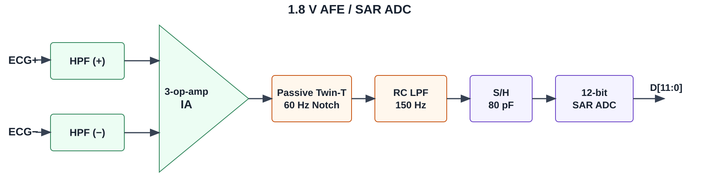

# 전체 시스템과 아날로그 구성 및 동작

> [설계보고서 PDF](../reports/ECG_Design_Report_2026.pdf)의 해당 본문을 옮겼습니다.

<!-- report:p3:id14 -->
## 2. 구성 및 동작

<!-- report:p3:id15 -->
### 1) 전체 시스템 구성

<!-- report:p3:id16 -->
전체 시스템은 ECG 전압을 디지털 코드로 바꾸는 아날로그부와 리듬을 판단하는 디지털부로 구성된다. AFE가 신호를 증폭하고 잡음을 줄이면 12-bit SAR ADC가 초당 1,000개의 코드로 변환한다. 외부 제어기는 이를 AXI-Stream으로 전달하고, 디지털부는 박동과 파형 특징을 추출해 구간 분류와 최종 누적을 수행한다. 신호 경로와 제어기 연결은 그림 1과 같다.

<!-- report:p3:id17 -->

<!-- report:p3:id18 -->
**그림 1. AFE–ADC와 AXI 인터페이스를 갖춘 디지털 분류 IP의 전체 구성**

<!-- report:p4:id19 -->
**표 1. 입력 규격과 판정 단위**

<!-- report:p4:id20 -->
| 항목 | 설계 규격 |
| --- | --- |
| 아날로그와 디지털 공급전압 | 1.8 V |
| ADC 분해능과 변환률 | 12비트, 초당 1,000회 |
| ECG 데이터 한 건의 입력 길이 | 1,805초: 초기 안정화 5초와 분류 구간 1,800초 |
| 분류에 사용하는 표본 | 데이터 한 건당 1,800,000개 |
| 구간 요약 | 60,000개 표본마다 1회 |
| 최종 판정 | 30개의 구간 요약마다 1회 |
| 출력 분류 | NSR / AF / OTHER |

<!-- report:p4:id21 -->
분류 구간 앞에 아날로그 필터의 초기 안정화 5초를 두고, 이때의 5,000개 코드는 분류에서 제외하였다. 이후 30분의 1,800,000개 표본으로 30회의 Snapshot과 한 번의 최종 판정을 얻는다.

<!-- report:p4:id22 -->
외부 제어기는 AXI-Stream으로 표본과 유효 신호를 보내고, IP가 수신 가능할 때 전달한다. 대기 중 표본은 보존하며, 판정이 끝나면 완료 인터럽트(IRQ)를 보낸다. AXI-Lite는 시작 명령, 상태 확인과 결과 읽기를 담당한다.

<!-- report:p4:id23 -->
### 2) 아날로그 구성 및 동작

<!-- report:p4:id24 -->
미세한 ECG 전압을 증폭하고 잡음을 줄이기 위해 GPDK045의 2 V 소자로 1.8 V AFE와 ADC 아날로그 회로를 구성하였다. 신호 경로와 실제 회로는 그림 2, 3과 같다.

<!-- report:p4:id25 -->

<!-- report:p4:id26 -->
**그림 2. AFE와 12-bit SAR ADC의 신호 처리 구조**

<!-- report:p4:id27 -->

<!-- report:p4:id28 -->
**그림 3. AFE–S/H–SAR ADC의 실제 회로와 주요 블록**

<!-- report:p5:id29 -->
피부의 서로 다른 위치에 부착한 두 전극의 신호는 고역통과필터(HPF)를 거쳐 저주파 성분이 줄어든다. 3-op-amp 계측증폭기(IA)는 두 입력의 미세한 ECG 전압 차이를 증폭하고 공통 잡음을 억제한다. 이어 수동 Twin-T 노치 필터와 RC 저역통과필터(LPF)로 60 Hz 전원 간섭과 고주파 성분을 줄여 샘플앤홀드(S/H)에 전달한다. S/H는 ADC 변환 동안 커패시터에 입력 전압을 유지한다. SAR ADC는 이를 커패시터 DAC(CDAC)의 시험 전압과 비교해 상위 비트부터 결정하고 12-bit 코드를 출력한다.

<!-- report:p5:id30 -->
아날로그 회로는 Cadence Virtuoso에서 트랜지스터 수준으로 구성하고, 변환 순서를 제어하는 Verilog-A SAR 모델을 연결해 Spectre로 검증하였다. 세부 설계 항목은 표 2와 같다.

<!-- report:p5:id31 -->
**표 2. 아날로그부의 설계 항목**

<!-- report:p5:id32 -->
| 설계 항목 | 회로의 고정 설정 |
| --- | --- |
| 전원 / 공통모드 / 기준전압 | 1.8 V / 0.9 V / 0.4~1.4 V |
| AFE 이득 / 필터 설계 주파수 | 199.36 V/V / HPF 0.48 Hz, 노치 60 Hz, LPF 150 Hz |
| 샘플앤홀드 / ADC | 80 pF / 12-bit SAR, 1 kSPS, 오프셋 이진 |
