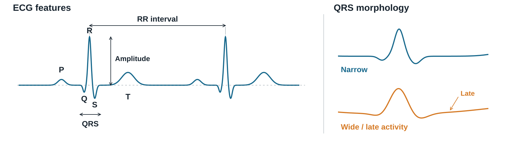
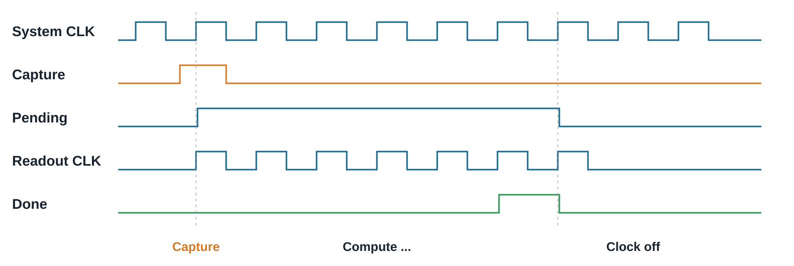
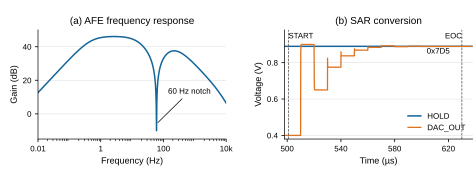

# 아날로그 전처리와 디지털 뉴로모픽 구조를 결합한 장시간 ECG 리듬 분류용 저전력 ASIC 설계

[설계보고서 PDF](ECG_Design_Report_2026.pdf)

[설계 요약 · 창의성 · 난이도 · 완성도](../docs/01_OVERVIEW_KR.md) | [전체 시스템과 아날로그 구성 및 동작](../docs/02_SYSTEM_AND_ANALOG_KR.md) | [디지털 구성 및 동작 · 저전력 클록 제어](../docs/03_DIGITAL_ARCHITECTURE_KR.md) | [데이터셋 구성 및 학습](../docs/04_DATASET_AND_TRAINING_KR.md) | [아날로그·디지털 검증과 최종 성능](../docs/05_VERIFICATION_AND_RESULTS_KR.md) | [면적, 타이밍 및 전력 분석](../docs/06_ASIC_POWER_KR.md) | [결론 및 제언 · 참고문헌](../docs/07_CONCLUSION_KR.md)

<!-- report:p2:id0 -->
## 1. 설계 요약

<!-- report:p2:id1 -->
ECG는 심장의 전기적 활동을 기록한 전압 파형으로, 간헐적 이상을 파악하려면 박동의 모양과 간격, 특징의 지속 양상을 살펴야 한다. 본 작품은 Holter 방식의 장시간 관찰을 위해 전체 파형을 저장하지 않고 박동 간격과 파형 특징에서 얻은 근거를 누적하는 저전력 ASIC을 설계하였다. 아날로그부는 1.8 V AFE로 ECG를 증폭하고 불필요한 성분을 줄인 뒤, 12-bit SAR ADC로 초당 1,000개의 코드를 생성한다. 디지털부는 박동 간격과 파형 특징을 60초 단위로 집계해 구간별 리듬을 분류하고, 각 구간의 판정 결과와 관찰된 특징에 따른 점수를 리듬별로 누적한다. 이후 누적 점수를 비교하여 전체 기록을 정상 동리듬(NSR), 심방세동(AF), 기타 비정상 리듬(OTHER) 중 하나로 최종 판정한다. 이 과정에 이벤트 기반 클록 게이팅을 적용해 연산할 때만 클록을 공급하고, 완료 후 차단하였다. 설계 결과 시험용 ECG 96건의 정확도는 94.79%였으며, 평균 소비전력은 아날로그부 0.256 mW, 디지털부 1.366 mW로 추정됐다. 이를 바탕으로 24시간 이상 관찰하는 웨어러블용 리듬 분류 IP를 지향한다.

<!-- report:p2:id2 -->
### 1) 창의성:

<!-- report:p2:id3 -->
간헐적인 심장 리듬 변화를 포착하려면 Holter 검사처럼 ECG를 오래 관찰해야 한다. 이를 몸에 붙이는 작은 기기에서 수행하려면 정확도와 함께 저장 공간과 전력을 고려해야 한다. 본 작품은 전체 파형 대신 판단에 필요한 정보를 남기고, 그 정보를 처리할 때 분류 회로를 동작시키도록 설계하였다.

<!-- report:p2:id4 -->
이를 위해 파형의 특징을 스파이크로 표현하고 분류 근거를 막전위에 누적하는 디지털 뉴로모픽 구조를 적용하였다. 박동 검출 뉴런은 입력 변화에서 얻은 사건을 누적해 기준에 도달하면 발화하고, 특징 검출 뉴런은 박동 간격의 규칙성과 파형 변화를 알린다. 60초 동안 모은 특징 누적값으로 구간을 분류하고, 판정 결과와 특징 근거를 Snapshot으로 요약한다. 여러 Snapshot의 근거를 리듬별 최종 막전위(Final Membrane)에 가중 누적한 뒤 세 막전위를 비교해 NSR, AF, OTHER 중 하나로 판정한다.

<!-- report:p2:id5 -->
처리 구조에 맞춰 입력 회로는 표본과 특징 전달을 마치면 클록을 차단하고, 분류 및 최종 누적 회로는 특징 누적값을 처리할 때만 동작시켰다. 특징별 계산에는 같은 연산 경로를 재사용하고 점수 범위에 맞춰 저장 폭을 정하였다. 뉴로모픽 특징 추출과 장기 판단에 필요한 연산 자원, 저장 공간과 클록 공급을 함께 설계한 점이 본 작품의 창의성이다.

<!-- report:p2:id6 -->
### 2) 난이도:

<!-- report:p2:id7 -->
장시간의 ECG를 적은 상태값으로 요약하는 구조에서는, 박동과 파형 특징에서 얻은 분류 근거가 누락이나 중복 없이 최종 판정까지 반영되어야 한다. 본 설계는 1 ms마다 들어오는 표본에서 박동과 특징을 검출하고, 이를 60초 단위로 집계한 뒤 여러 구간에 걸쳐 누적한다. 검출 단계의 작은 차이도 이후 특징 누적값과 Final 누적값 바꿀 수 있으므로, 최종 클래스의 일치만으로는 회로의 정확성을 확인하기 어렵다. 따라서 특징 검출부터 구간별 집계와 최종 누적까지 각 단계의 내부 값이 기준 모델과 비트 단위로 일치하는지 검증하는 것이 주요 과제였다.

<!-- report:p2:id8 -->
클록을 멈추는 시점도 처리 순서에 맞아야 한다. 입력 표본 하나를 받은 뒤에도 특징 검출과 증거 전달이 여러 클록에 걸쳐 이어지므로, 새 입력이 없다는 이유만으로 회로를 정지시킬 수 없다. 이에 입력 버퍼와 처리 중 상태를 확인해 남은 작업을 마친 뒤 정지하고, 재개 후에도 이전 누적값과 다음 입력의 순서가 유지되는지 검증하였다.

<!-- report:p2:id9 -->
또 다른 과제는 박동 간격이 비슷한 리듬들을 구분하는 것이었다. Zihlmann 등의 CNN–LSTM 연구는 NSR, AF, Other의 클래스 분류에서 평균 F1 82.1%를 보고하였다.[[1]](INTEGRATED_TECHNICAL_REPORT_KR.md#ref-1) AF가 아닌 비정상 리듬에서도 박동 간격이 불규칙할 수 있어 간격만으로 AF와 OTHER를 구분하기 어렵다.[[2]](INTEGRATED_TECHNICAL_REPORT_KR.md#ref-2) 이에 본 설계는 파형의 상승과 하강이 바뀌는 횟수, 박동 주변의 진폭과 활동 폭도 함께 집계하였고, 그 결과 학습에 사용한 원천 기록과 분리한 시험 96건에서 정확도 94.79%와 macro-F1 94.78%를 기록하여 선별된 특징들로 세 리듬을 분류할 수 있음을 확인하였다.

<!-- report:p3:id10 -->
### 3) 완성도:

<!-- report:p3:id11 -->
본 작품은 분류 코어에 AXI 입력, 제어와 결과 회수 경로를 구현하여 외부 제어기에서 사용할 수 있는 합성 가능한 RTL 블록(IP)으로 구성하였다. AXI-Stream으로 ECG 표본을 받고 AXI-Lite로 시작 명령, 상태 확인과 결과 읽기를 수행한다. 입력 대기 중 표본 보존과 완료 후 결과 회수까지 검증하여 상위 시스템 연결에 필요한 동작을 갖추었다.

<!-- report:p3:id12 -->
평가 데이터는 하나의 공개 데이터베이스에서 구성하고, 제공된 박동 및 리듬 판독 정보로 정답을 정하였다. 본 작품은 Holter 검사처럼 24시간 이상의 장시간 관찰을 지향하지만, 공개 데이터에서 클래스별로 명확한 리듬 주석을 확보하고 동일한 길이로 평가하기 위해 30분을 평가 단위로 정하였다. 총 471개 구간을 학습 282개, 설계 검증 93개, 최종 시험 96개로 나누고, 같은 원본 ECG 기록에서 잘라낸 구간이 학습과 시험에 동시에 포함되지 않도록 분리하였다.

<!-- report:p3:id13 -->
전체 471건의 14,130개 Snapshot에서 구간 점수와 매 Snapshot 처리 후 Final 누적값을 소프트웨어와 RTL 간에 대조하였다. 최종 시험 96건은 코어 직접 입력, AXI 입출력과 배선 지연 반영 조건으로 검증하였다. 모두 최종 클래스와 세 리듬의 누적값이 소프트웨어 계산과 일치하여, 지연을 고려한 조건에서도 입력 전달부터 분류와 결과 회수까지 정상 동작함을 확인하였다. 아날로그부는 트랜지스터 회로와 Verilog-A SAR 제어 모델을 연결해 1.8 V에서 필터와 ADC 변환을 검증하고, 통합 AVDD 평균 전력 256.43 µW를 확인하였다. 디지털부는 AXI를 포함한 합성, 배치배선과 타이밍 검증을 수행하고, 대표 30분 입력을 1 kSPS로 처리할 때의 평균 전력을 1.366 mW로 추정하였다. 회로 구성, 입출력 규격과 검증 결과를 신호 취득부터 결과 회수까지의 흐름에 따라 정리하였다.

<!-- report:p3:id14 -->
## 2. 구성 및 동작

<!-- report:p3:id15 -->
### 1) 전체 시스템 구성

<!-- report:p3:id16 -->
전체 시스템은 ECG 전압을 디지털 코드로 바꾸는 아날로그부와 리듬을 판단하는 디지털부로 구성된다. AFE가 신호를 증폭하고 잡음을 줄이면 12-bit SAR ADC가 초당 1,000개의 코드로 변환한다. 외부 제어기는 이를 AXI-Stream으로 전달하고, 디지털부는 박동과 파형 특징을 추출해 구간 분류와 최종 누적을 수행한다. 신호 경로와 제어기 연결은 그림 1과 같다.

<!-- report:p3:id17 -->

<!-- report:p3:id18 -->
**그림 1. AFE–ADC와 AXI 인터페이스를 갖춘 디지털 분류 IP의 전체 구성**

<!-- report:p4:id19 -->
**표 1. 입력 규격과 판정 단위**

<!-- report:p4:id20 -->
| 항목 | 설계 규격 |
| --- | --- |
| 아날로그와 디지털 공급전압 | 1.8 V |
| ADC 분해능과 변환률 | 12비트, 초당 1,000회 |
| ECG 데이터 한 건의 입력 길이 | 1,805초: 초기 안정화 5초와 분류 구간 1,800초 |
| 분류에 사용하는 표본 | 데이터 한 건당 1,800,000개 |
| 구간 요약 | 60,000개 표본마다 1회 |
| 최종 판정 | 30개의 구간 요약마다 1회 |
| 출력 분류 | NSR / AF / OTHER |

<!-- report:p4:id21 -->
분류 구간 앞에 아날로그 필터의 초기 안정화 5초를 두고, 이때의 5,000개 코드는 분류에서 제외하였다. 이후 30분의 1,800,000개 표본으로 30회의 Snapshot과 한 번의 최종 판정을 얻는다.

<!-- report:p4:id22 -->
외부 제어기는 AXI-Stream으로 표본과 유효 신호를 보내고, IP가 수신 가능할 때 전달한다. 대기 중 표본은 보존하며, 판정이 끝나면 완료 인터럽트(IRQ)를 보낸다. AXI-Lite는 시작 명령, 상태 확인과 결과 읽기를 담당한다.

<!-- report:p4:id23 -->
### 2) 아날로그 구성 및 동작

<!-- report:p4:id24 -->
미세한 ECG 전압을 증폭하고 잡음을 줄이기 위해 GPDK045의 2 V 소자로 1.8 V AFE와 ADC 아날로그 회로를 구성하였다. 신호 경로와 실제 회로는 그림 2, 3과 같다.

<!-- report:p4:id25 -->

<!-- report:p4:id26 -->
**그림 2. AFE와 12-bit SAR ADC의 신호 처리 구조**

<!-- report:p4:id27 -->

<!-- report:p4:id28 -->
**그림 3. AFE–S/H–SAR ADC의 실제 회로와 주요 블록**

<!-- report:p5:id29 -->
피부의 서로 다른 위치에 부착한 두 전극의 신호는 고역통과필터(HPF)를 거쳐 저주파 성분이 줄어든다. 3-op-amp 계측증폭기(IA)는 두 입력의 미세한 ECG 전압 차이를 증폭하고 공통 잡음을 억제한다. 이어 수동 Twin-T 노치 필터와 RC 저역통과필터(LPF)로 60 Hz 전원 간섭과 고주파 성분을 줄여 샘플앤홀드(S/H)에 전달한다. S/H는 ADC 변환 동안 커패시터에 입력 전압을 유지한다. SAR ADC는 이를 커패시터 DAC(CDAC)의 시험 전압과 비교해 상위 비트부터 결정하고 12-bit 코드를 출력한다.

<!-- report:p5:id30 -->
아날로그 회로는 Cadence Virtuoso에서 트랜지스터 수준으로 구성하고, 변환 순서를 제어하는 Verilog-A SAR 모델을 연결해 Spectre로 검증하였다. 세부 설계 항목은 표 2와 같다.

<!-- report:p5:id31 -->
**표 2. 아날로그부의 설계 항목**

<!-- report:p5:id32 -->
| 설계 항목 | 회로의 고정 설정 |
| --- | --- |
| 전원 / 공통모드 / 기준전압 | 1.8 V / 0.9 V / 0.4~1.4 V |
| AFE 이득 / 필터 설계 주파수 | 199.36 V/V / HPF 0.48 Hz, 노치 60 Hz, LPF 150 Hz |
| 샘플앤홀드 / ADC | 80 pF / 12-bit SAR, 1 kSPS, 오프셋 이진 |

<!-- report:p5:id33 -->
### 3) 디지털 구성 및 동작

<!-- report:p5:id34 -->

<!-- report:p5:id35 -->
**그림 4. Genus 전체 회로와 주요 기능의 내부 회로 확대도**

<!-- report:p5:id36 -->
디지털부는 뉴로모픽 특징 추출부와 Snapshot 분류 및 Final 누적부로 구성되며, GPDK045 소자 기반 프로젝트용 1.8 V 셀로 합성하였다. 그림 4는 특징 추출부에서 공유 분류 연산부와 막전위 저장부로 이어지는 Genus 회로이다.

<!-- report:p5:id37 -->

<!-- report:p5:id38 -->
**그림 5. ECG 심전도 파형 개념도**

<!-- report:p6:id39 -->
디지털부의 동작은 입력된 ECG에서 박동을 검출하는 것부터 시작된다. 그림 5의 QRS파는 심실의 전기적 활성에 따른 빠른 전압 변화를 나타내므로, 이를 박동 검출의 기준으로 사용하였다. QRS 구간에서는 빠른 전압 변화가 이어지므로 연속한 두 표본의 차이인 ΔECG의 절댓값이 반복해서 커지는 구간을 QRS 후보로 삼았다. 이를 검출하기 위해 ΔECG의 절댓값이 문턱값을 넘을 때마다 Strong Event 스파이크를 발생시켜 QRS 뉴런의 막전위에 누적하고, 임계값에 도달하면 발화하여 박동을 알리도록 하였다. 발화 후에는 막전위를 초기화하고 불응기를 두어 같은 박동의 중복 검출을 억제하였다.

<!-- report:p6:id40 -->

<!-- report:p6:id41 -->
**그림 6. 특징 집계, Snapshot 분류와 Final 누적의 알고리즘**

<!-- report:p6:id42 -->
**표 3. 디지털부에서 추출하는 주요 분류 근거**

<!-- report:p6:id43 -->
| 관찰 항목 | 추출 회로와 계산 | 분류 근거 |
| --- | --- | --- |
| RR 규칙성 | PNN: 예상 범위와 다음 박동 비교 | 규칙적인 반복 |
| RR 변동 | RDM: 연속 RR의 절대 차이 | 간격 변화의 크기 |
| 조기 박동 | 짧은 RR 뒤의 긴 RR 검출 | 간헐적 박동 변화 |
| 굴곡과 진폭 | DSCR 방향 전환 / RAM 최대 진폭 | 파형의 굴곡과 크기 |
| QRS 모양 | MAF 활동 폭 / 후반부 지연 검출 | 넓거나 늦게 남는 변화 |

<!-- report:p6:id44 -->
그림 6의 RR Counter에서는 검출한 QRS 박동 사이의 표본 수를 세어 RR 간격을 구한다. 이를 이용해 PNN은 현재 RR에 가장 가까운 예상 간격을 선택하고, 다음 RR이 예상 범위 안이면 일치, 밖이면 불일치 스파이크를 발생시켜 박동 간격의 규칙성을 판단하도록 하였다. RDM은 현재와 직전 RR의 절대 차이를 비교해 간격의 변동 정도를 코드와 스파이크로 전달한다. 조기 박동 경로는 짧은 RR 뒤에 긴 RR이 이어지는 패턴을 찾아 지속적인 불규칙성과 간헐적 박동 변화를 구별하도록 구성하였다.

<!-- report:p6:id45 -->
파형의 굴곡과 진폭은 DSCR과 RAM으로 관찰하였다. DSCR은 ΔECG의 절댓값이 문턱값을 넘는 경우에 대해 값의 부호가 바뀔 때 스파이크를 발생시켜 상승과 하강의 전환을 검출하도록 설계하였다. RAM은 PNN이 예상한 다음 박동 주변에 관찰창을 열어 기준선 위쪽의 최대 진폭을 저장하고, 창이 닫히면 진폭 코드와 완료 스파이크를 전달하도록 설계하였다.

<!-- report:p6:id46 -->
QRS MAF는 박동 검출 전 120표본과 후 100표본에서 Strong Event의 첫 발생과 마지막 발생 사이의 활동 폭, 방향 전환 횟수와 기준선 대비 진폭 누적량을 계산하도록 하였다. 이를 기준 범위와 비교해 QRS 형태의 변화를 스파이크로 전달하고, 후반부 지연 검출 경로에서는 활동 폭과 후반부 사건 수를 함께 확인해 늦은 전압 변화가 반복되면 지연형 근거를 전달하도록 구성하였다.

<!-- report:p6:id47 -->
이렇게 검출한 스파이크 횟수와 특징 코드를 60초 단위로 모아 구간별 특징 누적값을 구하였다. 학습 데이터에서 정한 52개 조건에 따라 특징값이 임계값을 초과하는지 비교하고, 조건 충족 여부에 정수 가중치를 적용해 식 (1)의 점수를 계산하였다.

<!-- report:p7:id48 -->

<!-- report:p7:id49 -->
여기서 t는 60초 구간 번호, k는 NSR, AF, OTHER의 클래스, j는 조건 번호이다. z는 조건 충족 시 1, 미충족 시 0이며, w는 학습된 정수 가중치, b는 초기 점수이다. 가장 큰 구간 점수 s의 클래스를 예측하고, 판정 결과와 특징 근거를 Snapshot으로 묶어 Final 단계에 전달하도록 하였다.

<!-- report:p7:id50 -->
Final 단계에서는 식 (2)와 같이 특징 조건의 기여도와 예측 클래스의 기여도를 리듬별 막전위 V에 더하도록 하였다. 식의 S와 F는 Snapshot과 Final을, E와 C는 각각 특징 근거와 예측 클래스에 적용하는 가중치를 구분한다.

<!-- report:p7:id51 -->

<!-- report:p7:id52 -->
Snapshot 점수는 매 구간 분류 전에 학습된 초기값으로 초기화하고, Final 막전위는 전체 관측 시작 시 한 번만 초기화한 뒤 구간별 근거를 계속 누적하였다. 이후 구간별 판정과 특징 근거를 누적하고, 30개 Snapshot 처리 후 세 막전위를 비교해 최종 판정하였다. 같은 특징이 여러 구간에서 나타나면 근거도 반복 반영되며, Snapshot의 발생 순서 자체를 저장하지는 않는다.

<!-- report:p7:id53 -->
이러한 구조로 집계와 누적에 필요한 입력 이력과 상태값만 저장하여, 원시 ECG 전체를 보관하지 않도록 구성하였다. 또한 새 특징 누적값이 60초마다 도착하는 처리 주기에 맞춰 특징 조건을 순차적으로 계산하고 동일한 점수 누적 경로를 반복 사용하도록 설계하였으며, 가능한 최대 누적 범위를 계산해 구간 점수는 24비트, 최종 점수는 32비트로 저장함으로써 값의 손실 없이 레지스터 수를 줄였다.

<!-- report:p7:id54 -->
### 4) 처리 주기에 맞춘 저전력 클록 제어

<!-- report:p7:id55 -->
장시간 관찰에서는 계산보다 다음 입력을 기다리는 시간이 길다. 대기 중에도 클록을 공급하면 전력이 소비되므로, 표본 처리와 분류 작업이 발생할 때 열고 남은 처리를 마치면 닫는 이벤트 기반 클록 게이팅을 적용하였다.

<!-- report:p7:id56 -->
본 작품의 입력 처리부는 수락한 표본의 특징 검출과 사건 전달을 마친 뒤 다음 표본까지 정지한다. 분류 연산부는 60초 단위 특징 누적값의 수락 신호(Capture)가 들어오면 첫 클록을 받아 입력을 보관하고, 처리 중 상태(Pending)를 설정한다. Pending은 구간 점수 계산과 Final 갱신, 완료 신호 전달이 끝날 때까지 클록을 유지한다.

<!-- report:p7:id57 -->

<!-- report:p7:id58 -->
**그림 7. Capture 수락과 Pending에 따른 클록 공급의 상승 엣지 관계**

<!-- report:p7:id59 -->
클록 공급을 제어하기 위해 동작 특성이 확인된 집적 클록 게이팅 셀(ICG)을 사용하였다. ICG는 시스템 클록이 낮을 때 공급 여부를 결정해 펄스가 잘리지 않도록 한다. Capture가 첫 클록을 요청하고 첫 상승 에지에서 설정된 Pending이 완료까지 공급을 유지한다. 상태는 62.5 MHz 시스템 클록의 상승 에지에서 동기식으로 갱신한다.

<!-- report:p8:id60 -->
초기화와 시험에서는 reset 및 test/debug 신호로 클록을 강제 공급한다. 정상 동작에서는 입력 버퍼, 전달 중인 사건과 연산 완료 상태를 확인한 뒤 정지하여 남은 작업이 누락되지 않도록 하였다. 분류 입력은 수락 시 레지스터에 보관하고 계산 중 고정해 외부 변화에 따른 불필요한 동작을 줄였다.

<!-- report:p8:id61 -->
## 3. 설계 과정 및 실험 결과

<!-- report:p8:id62 -->
### 1) 데이터셋 구성 및 학습

<!-- report:p8:id63 -->
본 작품은 24시간 이상의 관찰을 지향하지만, 공개 데이터에서 클래스별로 명확한 정답과 서로 분리된 ECG 기록을 확보하여 같은 길이로 평가하기 위해 30분을 공통 단위로 정하였다. 세 클래스는 모두 PhysioNet Long-Term AF Database v1.0.0에서 구성하였다.[[3]](INTEGRATED_TECHNICAL_REPORT_KR.md#ref-3) 제공된 정보를 기준으로 NSR, AF, OTHER 구간을 선정하여 데이터 출처의 차이가 분류의 단서가 되지 않도록 하였다.

<!-- report:p8:id64 -->
**표 4. 30분 ECG 구간의 분류 기준**

<!-- report:p8:id65 -->
| 분류 | 30분 구간의 선정 기준 |
| --- | --- |
| NSR | 정상 동리듬 비율 99% 이상, AF와 다른 리듬 없음, 비정상 박동 1% 이하 |
| AF | 심방세동 비율 90% 이상, AF 이외의 비정상 리듬 1% 이하 |
| OTHER | AF 없음. 비-AF 비정상 리듬 50% 이상 또는 비정상 박동 30% 이상 |

<!-- report:p8:id66 -->
정답이 불명확하거나 판독 정보가 없는 구간은 제외하고, 파형 길이, 비정상적인 평탄 구간과 중복을 검사하였다. 같은 원본 ECG 기록의 구간은 학습, 설계 검증, 최종 시험 중 하나에만 배정해 유사 파형이 학습과 시험에 함께 쓰이지 않도록 하였다. 분할 기준은 환자가 아닌 ECG 기록이다.

<!-- report:p8:id67 -->
**표 5. 평가 데이터의 구성**

<!-- report:p8:id68 -->
| 분할 | NSR | AF | OTHER | 합계 |
| --- | --- | --- | --- | --- |
| 학습 | 94 | 94 | 94 | 282 |
| 설계 검증 | 31 | 31 | 31 | 93 |
| 최종 시험 | 32 | 32 | 32 | 96 |
| 전체 | 157 | 157 | 157 | 471 |

<!-- report:p8:id69 -->
학습에서는 특징 추출부를 고정하고 Snapshot 분류와 Final 누적의 가중치 및 초기 설정값을 구하였다. 학습용 ECG 282건의 8,460개 60초 구간 중 주석상 정답이 명확한 7,357개를 Snapshot 학습에 사용하고, 모호한 1,103개는 제외하였다. 각 구간의 정답은 해당 60초의 주석으로 정하여, 30분 전체의 정답을 일괄 적용하지 않았다.

<!-- report:p8:id70 -->
특정 기록이나 클래스가 학습을 지배하지 않도록 데이터별 비중을 조정하고, 계수가 지나치게 커지는 것을 억제하는 가중 ridge 회귀(α=0.1)로 두 단계의 가중치와 초기 점수를 구하였다. 입력 표준화는 계수와 초기 점수에 흡수한 뒤 정수화하여, RTL에서는 별도의 실수 정규화 없이 계산하도록 하였다. 가중치는 부호 있는 20비트 정수로 표현하였다.

<!-- report:p8:id71 -->
Final 학습에는 해당 기록을 학습하지 않은 Snapshot 모델의 예측을 사용하였다. 이를 위해 학습 기록을 다섯 묶음으로 나누고, 네 묶음으로 Snapshot 모델을 학습한 뒤 남은 한 묶음을 예측하는 과정을 반복하였다. 이렇게 얻은 30개 구간의 클래스별 예측 횟수와 특징 조건별 충족 횟수를 입력으로 Final을 학습하였다.

<!-- report:p9:id72 -->
학습한 모델을 정수화하고 ECG 93건으로 검증한 뒤 고정하였다. 이후 17개 원본 기록에서 구성한 ECG 96건으로 최종 시험을 수행했으며, 시험 결과를 보고 가중치나 임계값을 수정하지 않았다.

<!-- report:p9:id73 -->
### 2) 아날로그 검증 및 결과

<!-- report:p9:id74 -->
공개 ECG는 이미 디지털화된 기록이므로 표본의 시간과 전압값을 연결한 PWL 전압 자극으로 재구성해 AFE에 입력하였다. 이는 별도 DAC 칩이 아닌 시뮬레이션 전압원이다.

<!-- report:p9:id75 -->

<!-- report:p9:id76 -->
**그림 8. AFE 주파수 응답과 12-bit SAR ADC의 첫 변환 과정**

<!-- report:p9:id77 -->
AFE의 주파수 응답은 1.8 V, 27°C에서 평가하였다. 두 입력에 0.5 V 크기와 각각 0°, 180° 위상의 AC 신호를 인가해 차동 입력을 1 V로 두고, 출력과 차동 입력의 비로 이득을 구하였다. HPF와 LPF의 단독 차단 주파수는 0.4823 Hz와 150.15 Hz였으며, 전체 AFE의 60 Hz에서의 이득은 55 Hz와 65 Hz의 평균 이득보다 38.65 dB 낮게 나타났다. 저주파 기준선 변동과 고주파 성분을 제한하면서 전원 주파수 간섭을 억제하는 응답을 확인하였다.

<!-- report:p9:id78 -->
그림 8의 SAR 파형은 CDAC 출력(DAC_OUT)을 S/H에 저장된 전압(HOLD)과 비교해 코드를 결정하는 과정이다. START 501 µs부터 EOC 630 µs까지 약 129 µs가 걸려, 표본 간격인 1 ms 안에 변환을 마쳤다. 시뮬레이터의 최대 시간 간격을 5 ns에서 1 ns로 줄여 동일한 10 ms ECG 입력의 10개 변환을 비교한 결과, 코드 차이는 최대 1 LSB였고 표본 취득과 완료 시점은 같았다. 계산을 더 촘촘히 해도 결과가 거의 달라지지 않음을 확인할 수 있었다.

<!-- report:p9:id79 -->
**표 6. AFE/ADC 시뮬레이션의 주요 결과**

<!-- report:p9:id80 -->
| 평가 항목 | 시뮬레이션 결과 |
| --- | --- |
| 공정 / 전압 / 온도 | GPDK045 / 1.8 V / 27°C |
| HPF / LPF 차단 주파수 | 0.4823 Hz / 150.15 Hz (단독 필터) |
| 60 Hz 감쇠 | 38.65 dB (55/65 Hz 국소 기준 대비) |
| ADC 규격 / 1 LSB | 12-bit, 1 kSPS / 약 244.14 µV |
| 변환에 걸리는 시간 | START→EOC 약 129 µs |
| 계산 시간 간격 비교 | 1 ns와 5 ns, 10개 변환의 최대 차이 1 LSB |
| 통합 AVDD 전류 / 전력 | 142.46 µA / 256.43 µW |

<!-- report:p9:id81 -->
주요 결과는 표 6과 같다. 통합 전력은 AFE, S/H와 ADC 아날로그 회로가 연결된 공통 AVDD에서 측정한 값이며, Verilog-A SAR 제어 모델을 포함한 혼합 시뮬레이션 조건으로 제시하였다.

<!-- report:p10:id82 -->
### 3) 디지털 검증 및 결과

<!-- report:p10:id83 -->
디지털 검증에서는 소프트웨어로 계산한 특징과 분류 결과를 동일 입력의 RTL 결과와 비교하였다. C++ 정수 모델로 60초 단위 특징 누적값을 만들고, Python 모델에 고정된 가중치와 임계값을 적용해 구간 점수와 Final 누적값을 구하였다. 이를 기대값으로 저장하고 최종 클래스, 각 Snapshot의 세 구간 점수와 처리 후 Final 누적값을 비트 단위로 대조하였다.

<!-- report:p10:id84 -->
클록 제어는 입력 간격을 바꾸어 정지와 재개를 유도하고, reset 및 test/debug 조건을 적용해 검증하였다. 정지 중 입력과 누적값이 보존되고, 재개 후 남은 계산과 완료 신호 전달이 이어지는지 확인하였다. 초기화 시에는 내부 상태가 정해진 시작값으로 돌아가는지도 검사하였다.

<!-- report:p10:id85 -->
합성과 배치배선 과정에서 논리 기능이 유지되는지 확인하기 위해, 각 단계의 소자 연결 정보인 netlist를 비교하였다. 합성 후와 배치배선 후 netlist의 4,195개 비교점에서 논리적 동등성을 확인하였으며, 구현 검증 결과는 표 7에 정리하였다.

<!-- report:p10:id86 -->
**표 7. 디지털 회로의 단계별 검증 결과**

<!-- report:p10:id87 -->
| 검증 대상 | 비교 기준과 입력 범위 | 확인 결과 |
| --- | --- | --- |
| 구간 분류와 Final 누적 | 전체 ECG 데이터 471건에 대한 Python 정수 기대값과 RTL의 구간 점수와 Final 누적값 | NSR, AF, OTHER의 구간 점수와 Final 누적값 모두 bit exact |
| 클록 정지와 초기화 | 입력 간격, reset, test/debug 조건 변화 | 입력 보존, 완료 전달과 재개 후 결과 확인 |
| 합성 후 논리 등가성 | 합성 netlist와 배치배선 후 netlist | 4,195개 비교점 일치 |

<!-- report:p10:id88 -->
### 4) 통합 검증 방법과 최종 성능

<!-- report:p10:id89 -->
통합 검증은 ADC 코드의 코어 직접 입력, AXI 입출력과 배치배선 후 지연 반영의 세 조건으로 수행하였다. 모두 동일한 최종 시험용 ECG 데이터 96건을 사용했으며, 고정 AFE–ADC 모델이 생성한 코드에서 초기 안정화 5초를 제외한 30분 분량을 입력하였다. 비교 기준은 동일 코드로 계산한 C++ 특징 추출값과 Python 분류 기대값으로 정하였다.

<!-- report:p10:id90 -->
코어와 AXI 경로에서는 코드의 부호와 전달 순서, 최종 결과의 일치를 확인하고, AXI 입력 대기 중 표본 보존과 완료 후 결과 회수도 검증하였다. 배치배선 후 회로에는 셀과 배선의 지연을 반영하고 저장 소자를 각각 0과 1로 초기화한 두 조건을 적용하여, 지연을 고려한 각 초기화 조건에서도 계산 결과가 기대값과 일치하는지 확인하였다. 검증 조건별 입력 규모와 결과는 표 8에 정리하였다.

<!-- report:p10:id91 -->
**표 8. 통합 동작의 검증 항목과 결과**

<!-- report:p10:id92 -->
| 검증 경로 | 입력 데이터와 비교 기준 | 확인 결과 |
| --- | --- | --- |
| ADC→분류 코어 | 최종 시험 ECG 데이터 96건 C++ 특징 / Python 분류 기대값 | 데이터 당 Snapshot 30회의 구간 점수 및 최종 누적값 일치 |
| ADC→AXI→결과 읽기 | 최종 시험 ECG 데이터 96건 동일 코드의 소프트웨어 기대값 | 최종 클래스와 48비트 누적값 일치 |
| 배선 지연 반영 | 최종 시험 ECG 데이터 96건 동일 입력의 소프트웨어 기대값 | 초기값 0/1 두 조건에서 클래스와 누적값 일치 |

<!-- report:p10:id93 -->
고정 모델의 최종 분류 성능은 표 9와 표 10과 같다. 학습 및 설계 검증과 원본 ECG 기록이 겹치지 않는 30분 구간 96개를 사용했으며, 각 클래스는 32개이다. 91개가 데이터베이스에서 정한 정답과 일치하여 정확도 94.79%, macro-F1 94.78%를 기록하였다.

<!-- report:p11:id94 -->
**표 9. 최종 시험의 분류 성능**

<!-- report:p11:id95 -->
| 항목 | 최종 시험 결과 |
| --- | --- |
| 정확도 / macro-F1 | 94.79% / 94.78% |
| NSR 정밀도 / 재현율 / F1 | 96.88% / 96.88% / 96.88% |
| AF 정밀도 / 재현율 / F1 | 100.00% / 87.50% / 93.33% |
| OTHER 정밀도 / 재현율 / F1 | 88.89% / 100.00% / 94.12% |
| 기록별 균등 평균 재현율 | 94.31% (17개 원본 ECG 기록) |
| 기록별 다수결 비교 | 선정된 시험 구간의 정답 다수결과 15개 기록 일치 / 예측 동률 2개 |

<!-- report:p11:id96 -->
**표 10. 최종 시험의 혼동행렬 (행: 정답 / 열: 예측)**

<!-- report:p11:id97 -->
| 정답 / 예측 | NSR | AF | OTHER |
| --- | --- | --- | --- |
| NSR | 31 | 0 | 1 |
| AF | 1 | 28 | 3 |
| OTHER | 0 | 0 | 32 |

<!-- report:p11:id98 -->
오분류 5건 중 4건은 AF였고 이 중 3건은 OTHER로 예측되었다. 후속 개선에서는 간격과 파형 특징이 다른 결론을 지지하는 구간을 분석해 AF와 OTHER의 구분 근거를 보완할 필요가 있다.

<!-- report:p11:id99 -->
### 5) 면적, 타이밍 및 전력 분석

<!-- report:p11:id100 -->
AXI를 포함한 디지털부를 Cadence Genus로 합성하고 Innovus로 배치배선하여 면적, 타이밍과 전력을 평가하였다. 배선 지연과 부하를 반영하고 1.8 V, 대표 공정 조건(TT), 25°C, 62.5 MHz에서 분석하여 최종 배치배선 결과와 주요 구현 수치는 그림 9와 표 11에 제시하였다.

<!-- report:p11:id101 -->

<!-- report:p11:id102 -->
**그림 9. 디지털 분류 회로의 Innovus 배치배선 결과**

<!-- report:p12:id103 -->
**표 11. 제안 방식의 ASIC 구현 결과**

<!-- report:p12:id104 -->
| 항목 | 배치배선 후 결과 |
| --- | --- |
| 셀 점유 면적 / 인스턴스 | 17.5846 mm² (padding 포함) / 43,957개 |
| 셋업 / 홀드 WNS | +4.105 ns / +0.030 ns |
| 보고된 신호 검사 | DRV 0 / signal DRC 0 |
| ICG enable 타이밍 | 195개 / setup +5.405 ns, hold +0.415 ns |
| 셀 모델 / 평가 조건 | GPDK045 소자 기반 프로젝트용 A18 셀 / 1.8 V, TT, 25°C, 62.5 MHz |

<!-- report:p12:id105 -->
셀 점유 면적은 배치에 사용한 셀 외곽 크기인 LEF footprint의 합계로, padding을 포함하였다. 16 ns 클록 주기에서 셋업과 홀드 시간 여유가 모두 양수였으며, 195개 ICG 제어 신호도 시간 조건을 만족하였다. 구간 분류와 Final 누적에 필요한 최대 112클록은 1.792 µs로, 60초마다 도착하는 특징 누적값을 순차 처리할 시간 여유를 확보하였다.

<!-- report:p12:id106 -->
아날로그부는 1.8 V, 27°C의 혼합 시뮬레이션에서 AFE, S/H와 SAR ADC가 연결된 공통 AVDD의 전류를 측정하였다. 초기 구간을 제외한 5~10 ms의 평균 소비전력은 256.43 µW였다. 디지털부는 대표 30분 ECG 1건의 1,800,000개 표본을 1 kSPS로 입력하여 배치배선 후 전력을 추산하였다. 연산과 입력 대기 시간을 포함한 평균 전력 및 처리 성능을 표 12에 정리하였다.

<!-- report:p12:id107 -->
**표 12. 아날로그 및 디지털부의 소비전력과 디지털 처리 성능**

<!-- report:p12:id108 -->
| 항목 | 분석 결과 |
| --- | --- |
| 아날로그부 평균 전력 | 0.256 mW |
| 디지털 평균 총전력 | 1.365571 mW |
| FF/ICG 클록 입력 내부 전력 | 0.739063 mW |
| 입력 표본당 에너지 | 1.365571 µJ |
| 60초당 평균 에너지 | 81.934264 mJ |
| 30분 판정당 에너지 | 2.458028 J |
| 마지막 입력→IRQ 지연 | 2.402525 µs |

<!-- report:p12:id109 -->
이어 클록 제어 방식의 영향을 살펴보기 위해 현재 설계의 일반 동기식, 이벤트 기반 클록 게이팅과 선택적 비동기 Hybrid를 비교하고, 클록 게이팅을 기준으로 전력과 셀 점유 면적을 표 13에 정리하였다.

<!-- report:p12:id110 -->
**표 13. 클록 제어 구조의 비교 결과**

<!-- report:p12:id111 -->
| 구조 | 전력 / 셀 점유 면적 | 비교 결과 |
| --- | --- | --- |
| 일반 동기식 (Sync-Base) | 11.137460 mW / 17.6461 mm² | 전력 +715.59% / 면적 +0.35% |
| 이벤트 기반 클록 게이팅 | 1.365571 mW / 17.5846 mm² | 동일 조건 저전력 선택 |
| 선택적 비동기 Hybrid | 1.403081 mW / 17.0599 mm² | 전력 +2.7469% / 면적 −2.9834% |

<!-- report:p12:id112 -->
이벤트 기반 클록 게이팅은 일반 동기식보다 셀 점유 면적의 차이가 작으면서도 소비전력을 약 87.74% 줄였다. Hybrid는 클록 게이팅보다 면적이 약 2.98% 작았지만 전력은 약 2.75% 높았다. 이에 장시간 ECG 관찰에서의 전력 절감을 우선하여, 필요한 계산 동안만 클록을 공급하는 이벤트 기반 클록 게이팅 구조를 채택하였다.

<!-- report:p13:id113 -->
### 6) 결론 및 제언

<!-- report:p13:id114 -->
웨어러블 ECG 연구는 기기 안에서 이상을 판단해 저장과 전송 부담을 줄이는 방향으로 발전하고 있다. Bauer 등은 이벤트 기반 뉴로모픽 이상 검출[[4]](INTEGRATED_TECHNICAL_REPORT_KR.md#ref-4), Chu 등은 스파이크 구동 SNN[[5]](INTEGRATED_TECHNICAL_REPORT_KR.md#ref-5), Bhanushali 등은 ADC와 분류 회로의 칩 통합[[6]](INTEGRATED_TECHNICAL_REPORT_KR.md#ref-6), Busia 등은 저전력 마이크로컨트롤러 기반 Transformer[[7]](INTEGRATED_TECHNICAL_REPORT_KR.md#ref-7)로 기기 내 분석의 가능성을 제시하였다.

<!-- report:p13:id115 -->
본 작품은 이러한 흐름에서 Holter 방식의 장시간 관찰에서 반복되는 특징을 제한된 저장 공간에 남기는 데 초점을 맞추었다. AFE–ADC 입력에서 검출한 박동과 파형 특징을 Snapshot으로 요약하고 Final 막전위에 누적해, 전체 원시 파형을 보관하지 않고 장기 리듬을 판단하도록 하였다.

<!-- report:p13:id116 -->
전용 ASIC에서는 이 처리 방식에 맞춰 연산 경로를 재사용하고 저장 폭과 클록 공급 시점을 정하였다. 뉴로모픽 특징 추출, 계층적 증거 누적과 이벤트 기반 클록 게이팅을 하나의 장시간 분석 구조로 연결한 점이 본 작품의 기여이다.

<!-- report:p13:id117 -->
최종 시험 96건에서 정확도 94.79%와 macro-F1 94.78%를 기록하고, AXI 및 배선 지연 반영 검증에서도 계산 결과의 일치를 확인하였다. 평균 전력은 아날로그부 약 0.256 mW, 대표 30분 입력을 처리한 디지털부 약 1.366 mW로 추정되어 장시간 ECG 분석용 IP의 구현 기반을 마련하였다.

<!-- report:p13:id118 -->
현재 모델의 장시간 적용 가능성을 살피기 위해 24시간 ECG 9건을 예비 평가하였다. NSR 우세 3건은 NSR 2건과 OTHER 1건으로, AF 우세 3건은 모두 AF로 예측되었다. OTHER 혼합 3건은 NSR, AF, OTHER로 각각 1건씩 예측되어, 혼합 리듬 기록의 판정 기준과 누적 방식에 대한 추가 검토가 필요하다.

<!-- report:p13:id119 -->
이를 바탕으로 더 많은 환자의 24시간 이상 ECG 데이터를 확보하고, 본 구조의 분류 가중치와 누적 방식을 장시간 입력에 맞춰 재튜닝한 뒤 독립된 기록에서 성능을 검증하고자 한다. 구간별 판정 시각과 이상이 의심되는 원시 파형을 선택적으로 보존하고, 실제 착용 환경에서 짧은 이상과 움직임 잡음에 대한 검증을 보완하여 의료진의 판독을 돕는 저전력 ECG 패치용 IP로 발전시키고자 한다.

<!-- report:p13:id120 -->
### 7) 참고문헌

<!-- report:p13:id121 -->

[1] M. Zihlmann et al., “Convolutional Recurrent Neural Networks for Electrocardiogram Classification,” CinC, vol. 44, pp. 1–4, 2017. DOI: 10.22489/CinC.2017.070-060.

<!-- report:p13:id122 -->

[2] G. D. Clifford et al., “AF Classification from a Short Single Lead ECG Recording: The PhysioNet/Computing in Cardiology Challenge 2017,” CinC, 2017. DOI: 10.22489/CinC.2017.065-469.

<!-- report:p13:id123 -->

[3] PhysioNet, Long-Term AF Database v1.0.0. DOI: 10.13026/C2QG6Q.

<!-- report:p13:id124 -->

[4] F. C. Bauer et al., “Real-Time Ultra-Low Power ECG Anomaly Detection Using an Event-Driven Neuromorphic Processor,” IEEE TBCAS, 2019. DOI: 10.1109/TBCAS.2019.2953001.

<!-- report:p13:id125 -->

[5] H. Chu et al., “A Neuromorphic Processing System With Spike-Driven SNN Processor for Wearable ECG Classification,” IEEE TBCAS, vol. 16, no. 4, pp. 511–523, 2022. DOI: 10.1109/TBCAS.2022.3189364.

<!-- report:p13:id126 -->

[6] S. P. Bhanushali et al., “Fully Integrated Mixed-Signal Classifier for Cardiovascular Health Monitoring,” IEEE BioCAS, 2023. DOI: 10.1109/BioCAS58349.2023.10388918.

<!-- report:p13:id127 -->

[7] P. Busia et al., “A Noisy Beat is Worth 16 Words: a Tiny Transformer for Low-Power Arrhythmia Classification on Microcontrollers,” 2024. arXiv:2402.10748v1.
